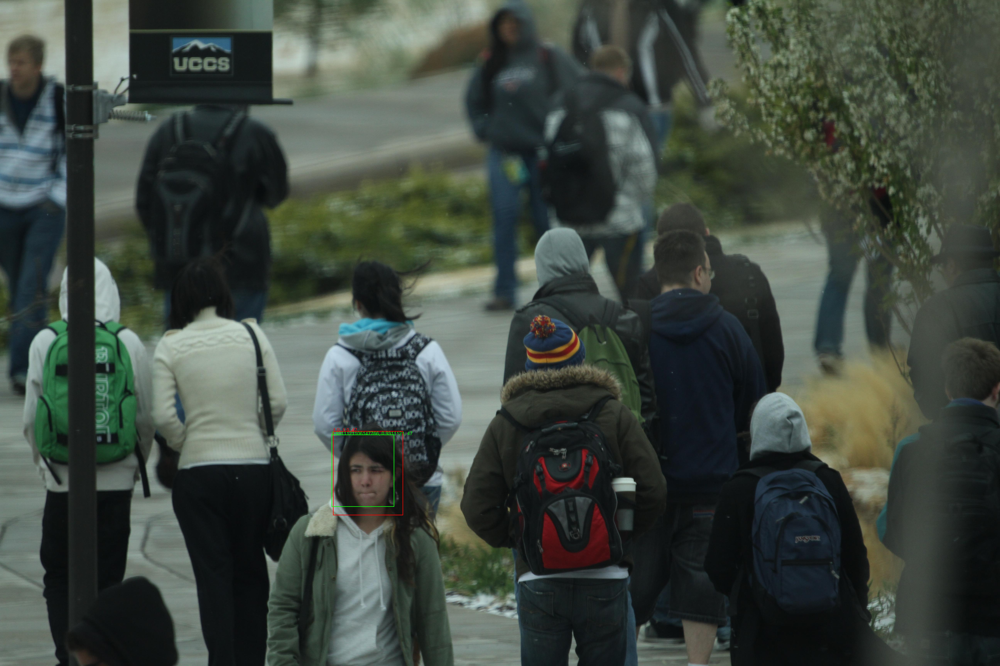

# Face vijnana yolov3
## Face recognition Keras model based on yolov3 including face detection and face identification



Using the pretranied [yolov3 Keras model](https://github.com/experiencor/keras-yolo3), we develop one shot learning face recognition model using Keras.
The face recognition model consists of face detection and face identification models, and using uncontrained college students face dataset provided by 
[UCCS](https://vast.uccs.edu/Opensetface/), the face detection and face identification models are trained and evaluated.
In the face detection model, we have developed referring to [YOLOv3: An Incremental Improvement](https://pjreddie.com/media/files/papers/YOLOv3.pdf), and 
in the face identification model, we have developed referring to [FaceNet: A Unified Embedding for Face Recognition and Clustering](https://arxiv.org/abs/1503.03832).

## Test environments
The face recognition model has been developed and tested on Linux(Ubuntu 16.04.6 LTS), Anaconda 4.6.11, Python 3.6.8, 
Tensorflow 1.13.1 (Keras's backend), Keras 2.2.4 and on 8 CPUs, 52 GB memory, 4 x NVIDIA Tesla K80 GPUs.

## Training and testing procedure
### Install [Anaconda](https://docs.anaconda.com/anaconda/install/linux/)

### After installing Anaconda, create the environment.

```conda create -n tf36 python=3.6```

### Go to the created environment.

```conda activate tf36```

### Install [CUDA Toolkit 10.1](https://developer.nvidia.com/cuda-downloads?target_os=Linux&target_arch=x86_64&target_distro=Ubuntu&target_version=1604&target_type=debnetwork)

### Install [cuDNN v7.6.0 for CUDA 10.1](https://developer.nvidia.com/rdp/cudnn-download) 

### Install necessary python packages.

```pip install tensorflow-gpu keras scikit-image scikit-learn pandas Pillow```

```conda install opencv```

### Download the face recognition git repository.

```git clone https://github.com/tonandr/face_recog_yolov3.git```

```cd face_recog_yolov3\src\space```

### Download yolov3 pretrained model weight.

```wget https://pjreddie.com/media/files/yolov3.weights```

### Make the resource directory and in the resource directory, make the training and validation folders, and copy training images & training.csv into the training folder and validation images & validation.csv into the validation folder.

The dataset can be obtained from [UCCS](https://vast.uccs.edu/Opensetface/).

### Configuration json format file (face_vijnana_yolov3.json).

```
{
	"fd_conf": {
		"mode": "train",
		"raw_data_path": "/home/ubuntu/face_recog/resource/training",
		"test_path": "/home/ubuntu/face_recog/resource/validation",
		"output_file_path": "solution_fd.csv",
		"multi_gpu": true,
		"num_gpus": 4,
		"yolov3_base_model_load": true,
		"hps": {
			"lr": 0.0001,
			"beta_1": 0.99,
			"beta_2": 0.99,
			"decay": 0.0,
			"epochs": 6,
			"step": 1,
			"batch_size": 40,
			"face_conf_th": 0.5,
			"nms_iou_th": 0.5,
			"num_cands": 60,
			"face_region_ratio_th": 0.8
		},
			
		"nn_arch": {
			"image_size": 416,
			"bb_info_c_size": 6
		},
			
		"model_loading": false
	},
	
	"fi_conf": {
		"mode": "fid_db",
		"raw_data_path": "/home/ubuntu/face_recog/resource/training",
		"test_path": "/home/ubuntu/face_recog/resource/validation",
		"output_file_path": "solution_fi.csv",
		"multi_gpu": true,
		"num_gpus": 4,
		"yolov3_base_model_load": false,
		"hps": {
			"lr": 0.001,
			"beta_1": 0.99,
			"beta_2": 0.99,
			"decay": 0.0,
			"epochs": 1,
			"step": 1,
			"batch_size": 1,
			"sim_th": 0.7
		},
			
		"nn_arch": {
			"image_size": 416,
			"dense1_dim": 64
		},
			
		"model_loading": true
	}
}
```

### First, train the face detection model. It is assumed that 4 Tesla K80 GPUs are provided. You should set mode to "train". For accelerating computing, you can set multi_gpu to True and the number of gpus.

```python face_detection.py```

### Evaluate the model via generating detection result images, or test the model, via setting mode to 'evaluate' or 'test'. Here, you should set model_loading to true.

```python face_detection.py```

### Create subject faces and database. Mode should be set to "data" in fi_conf.

```python face_identification.py```

### Train the face identification model via setting mode to "train". To train the model with previous weights, you should set model_loading to 1.

```python face_dentification.py```

### Evaluate the model via generating detection result images, or test the model. Here, you should set model_loading to true.

```python face_identification.py```

# Performance
TODO
