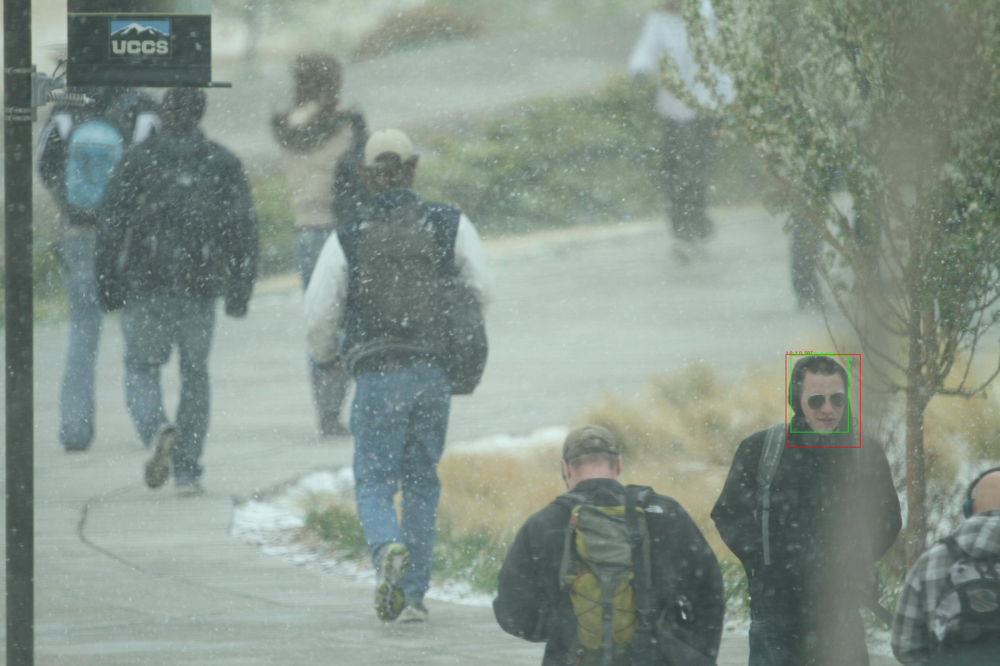

# Face vijnana yolov3
## Face recognition Keras model using yolov3 as a base model and a pretrained model, including face detection and face identification


Using the pretranied [yolov3 Keras model](https://github.com/experiencor/keras-yolo3), we develop one shot learning face recognition model using Keras.
The face recognition model consists of face detection and face identification models, and using uncontrained college students face dataset provided by 
[UCCS](https://vast.uccs.edu/Opensetface/), the face detection and face identification models are trained and evaluated.
In the face detection model, we have developed referring to [YOLOv3: An Incremental Improvement](https://pjreddie.com/media/files/papers/YOLOv3.pdf), and 
in the face identification model, we have developed referring to [FaceNet: A Unified Embedding for Face Recognition and Clustering](https://arxiv.org/abs/1503.03832).

# Tasks
- [x] Develop face vijnana yolov3.
- [x] Train and evaluate face detetor with the UCCS dataset.
- [ ] Train and evaluate face identifier using [a GAN style-based face generator](https://github.com/NVlabs/stylegan) with the UCCS dataset.
- [ ] Train, evaluate and optimize face vijnana yolov3 with other datasets.

## Test environments
The face recognition model has been developed and tested on Linux(Ubuntu 16.04.6 LTS), Anaconda 4.6.11, Python 3.6.8, 
Tensorflow 1.13.1 (Keras's backend), Keras 2.2.4 and on 8 CPUs, 52 GB memory, 4 x NVIDIA Tesla K80 GPUs.

## Training and testing procedure
### Install [Anaconda](https://docs.anaconda.com/anaconda/install/linux/)

### After installing Anaconda, create the environment

```conda create -n tf36 python=3.6```

### Go to the created environment

```conda activate tf36```

### Install [CUDA Toolkit 10.1](https://developer.nvidia.com/cuda-downloads?target_os=Linux&target_arch=x86_64&target_distro=Ubuntu&target_version=1604&target_type=debnetwork)

### Install [cuDNN v7.6.0 for CUDA 10.1](https://developer.nvidia.com/rdp/cudnn-download) 

### Install necessary python packages

```pip install tensorflow-gpu keras scikit-image scikit-learn pandas Pillow```

```conda install opencv```

### Download the face recognition git repository

```git clone https://github.com/tonandr/face_vijnana_yolov3.git```

```cd face_vijnana_yolov3\src\space```

### Download yolov3 pretrained model weight

```wget https://pjreddie.com/media/files/yolov3.weights```

### Make the resource directory

In the resource directory, make the training and validation folders, and copy training images & training.csv into the training folder and validation images & validation.csv into the validation folder.

The dataset can be obtained from [UCCS](https://vast.uccs.edu/Opensetface/).

### Configuration json format file (face_vijnana_yolov3.json)

```
{
	"fd_conf": {
		"mode": "train",
		"raw_data_path": "/home/ubuntu/face_recog/resource/training",
		"test_path": "/home/ubuntu/face_recog/resource/validation",
		"output_file_path": "solution_fd.csv",
		"multi_gpu": true,
		"num_gpus": 4,
		"yolov3_base_model_load": true,
		"hps": {
			"lr": 0.0001,
			"beta_1": 0.99,
			"beta_2": 0.99,
			"decay": 0.0,
			"epochs": 67,
			"step": 1,
			"batch_size": 40,
			"face_conf_th": 0.5,
			"nms_iou_th": 0.5,
			"num_cands": 60,
			"face_region_ratio_th": 0.8
		},
			
		"nn_arch": {
			"image_size": 416,
			"bb_info_c_size": 6
		},
			
		"model_loading": false
	},
	
	"fi_conf": {
		"mode": "fid_db",
		"raw_data_path": "/home/ubuntu/face_recog/resource/training",
		"test_path": "/home/ubuntu/face_recog/resource/validation",
		"output_file_path": "solution_fi.csv",
		"multi_gpu": true,
		"num_gpus": 4,
		"yolov3_base_model_load": false,
		"hps": {
			"lr": 0.000001,
			"beta_1": 0.99,
			"beta_2": 0.99,
			"decay": 0.0,
			"epochs": 35,
			"step": 1,
			"batch_size": 16,
			"sim_th": 0.2
		},
			
		"nn_arch": {
			"image_size": 416,
			"dense1_dim": 64
		},
			
		"model_loading": true
	}
}
```

### First, train the face detection model 

It is assumed that 4 Tesla K80 GPUs are provided. You should set mode to "train". For accelerating computing, you can set multi_gpu to true and the number of gpus.

```python face_detection.py```

You can download [the pretrained face detection Keras model](https://drive.google.com/open?id=1pzGO4YyR46VaMLNeP4_462vWWydAAnYG).
It should be moved into face_vijnana_yolov3/src/space.

We have trained it as follows with previous configurations. You can configure them as a new configuration format and train the model.

```
python face_detection.py --mode train --raw_data_path /data/home/ubuntu/nfr/resource/training --image_size 416 --num_filters 6 --lr 0.001 --beta_1 0.9 --beta_2 0.9 --decay 0.0 --step_per_epoch 500 --epochs 12 --face_conf_th 0.5 --nms_iou_th 0.5 --num_cands 60 --model_loading 0
python face_detection.py --mode train --raw_data_path /data/home/ubuntu/nfr/resource/training --image_size 416 --num_filters 6 --lr 0.001 --beta_1 0.9 --beta_2 0.9 --decay 0.0 --step_per_epoch 500 --epochs 6 --face_conf_th 0.5 --nms_iou_th 0.5 --num_cands 60 --model_loading 1
python face_detection.py --mode train --raw_data_path /data/home/ubuntu/nfr/resource/training --image_size 416 --num_filters 6 --lr 0.0001 --beta_1 0.9 --beta_2 0.9 --decay 0.0 --step_per_epoch 500 --epochs 6 --face_conf_th 0.5 --nms_iou_th 0.5 --num_cands 60 --model_loading 1
python face_detection.py --mode train --raw_data_path /data/home/ubuntu/nfr/resource/training --image_size 416 --num_filters 6 --lr 0.0001 --beta_1 0.9 --beta_2 0.9 --decay 0.0 --step_per_epoch 500 --epochs 6 --face_conf_th 0.5 --nms_iou_th 0.5 --num_cands 60 --model_loading 1
python face_detection.py --mode train --raw_data_path /data/home/ubuntu/nfr/resource/training --image_size 416 --num_filters 6 --lr 0.0001 --beta_1 0.99 --beta_2 0.9 --decay 0.0 --step_per_epoch 500 --epochs 6 --face_conf_th 0.5 --nms_iou_th 0.5 --num_cands 60 --model_loading 1
python face_detection.py --mode train --raw_data_path /data/home/ubuntu/nfr/resource/training --image_size 416 --num_filters 6 --lr 0.0001 --beta_1 0.99 --beta_2 0.99 --decay 0.0 --batch_size 160 --epochs 1 --face_conf_th 0.5 --nms_iou_th 0.5 --num_cands 60 --model_loading 1 # Multi gpu.
python face_detection.py --mode train --raw_data_path /home/ubuntu/face_recog/resource/training --image_size 416 --num_filters 6 --lr 0.0001 --beta_1 0.99 --beta_2 0.99 --decay 0.0 --batch_size 40 --epochs 6 --face_conf_th 0.5 --nms_iou_th 0.5 --num_cands 60 --model_loading 1
python face_detection.py --mode train --raw_data_path /home/ubuntu/face_recog/resource/training --image_size 416 --num_filters 6 --lr 0.0001 --beta_1 0.99 --beta_2 0.99 --decay 0.0 --batch_size 40 --epochs 12 --face_conf_th 0.5 --nms_iou_th 0.5 --num_cands 60 --model_loading 1
python face_detection.py --mode train --raw_data_path /home/ubuntu/face_recog/resource/training --image_size 416 --num_filters 6 --lr 0.0001 --beta_1 0.99 --beta_2 0.99 --decay 0.0 --batch_size 40 --epochs 6 --face_conf_th 0.5 --nms_iou_th 0.5 --num_cands 60 --model_loading 1
python face_detection.py --mode train --raw_data_path /home/ubuntu/face_recog/resource/training --image_size 416 --num_filters 6 --lr 0.0001 --beta_1 0.99 --beta_2 0.99 --decay 0.0 --batch_size 40 --epochs 6 --face_conf_th 0.5 --nms_iou_th 0.5 --num_cands 60 --model_loading 1
```

### Evaluate the model via generating detection result images, or test the model

Set mode to 'evaluate' or 'test', and you should set model_loading to true.

```python face_detection.py```

### Create subject faces and database 

Mode should be set to "data" in fi_conf.

```python face_identification.py```

### Train the face identification model 

Set mode to "train". To train the model with previous weights, you should set model_loading to 1.

```python face_identification.py```

### Evaluate the model via generating detection result images, or test the model 

You should set model_loading to true.

```python face_identification.py```

# Performance
## Face detection performance
### Calculate mean average precision according to IoU threshold

After getting the face detection solution file of solution_fd.csv, mAP could be calculated as follows.

```python evaluate.py -m cal_map_fd -g validation.csv -s solution_fd.csv```

the result is saved in p_r_curve.h5 as the hdf5 format, so you load it and analyze the performance.

### Current face detection performance


We have evaluated face vijnana yolov3's face detection performance with the UCCS dataset. Yet, the model wasn't trained until saturation, so via training more, the performance can be enhanced.

<table>
<thead>
<tr>
<th>mAP</th>
<th>AP50</th>
<th>AP55</th>
<th>AP60</th>
<th>AP65</th>
<th>AP70</th>
<th>AP75</th>
<th>AP80</th>
<th>AP85</th>
<th>AP90</th>
<th>AP95</th>
</tr>
</thead>
<tbody>
<tr>
<td>23.57</td>
<td>67.21</td>
<td>58.35</td>
<td>46.61</td>
<td>33.04</td>
<td>19.45</td>
<td>8.41</td>
<td>2.32</td>
<td>0.35</td>
<td>0.0172</td>
<td>0.0000635</td>
</tr>
</tbody>
</table>

There are [face detection result images](https://drive.google.com/open?id=1JelgyzOEN1WNXUl1HKIY2eH_yEcaJ7fA).
## Face identification performance
TODO
