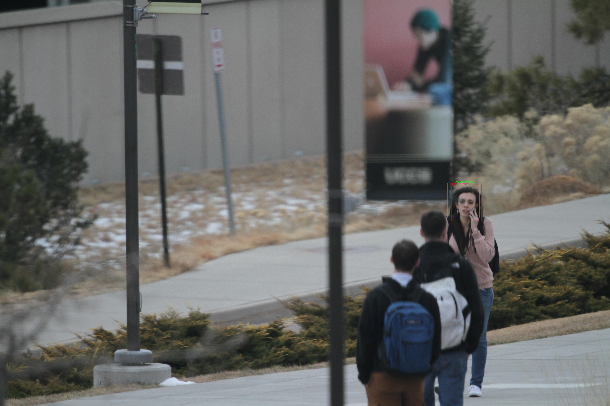

# Face recognition Keras model based on yolov3


Using the pretranied [yolov3 Keras model](https://github.com/experiencor/keras-yolo3), we develop one shot learning face recognition model using Keras.
The face recognition model consists of face detection and face identification models, and using uncontrained college students face dataset provided by 
[UCCS](https://vast.uccs.edu/Opensetface/), the face detection and face identification models are trained and evaluated.
In the face detection model, we have developed referring to [YOLOv3: An Incremental Improvement](https://pjreddie.com/media/files/papers/YOLOv3.pdf), and 
in the face identification model, we have developed referring to [FaceNet: A Unified Embedding for Face Recognition and Clustering](https://arxiv.org/abs/1503.03832).

## Test environments
The face recognition model has been developed and tested on Linux(Ubuntu 16.04.6 LTS), Anaconda 4.6.11, Python 3.6.8, 
Tensorflow 1.13.1 (Keras's backend), Keras 2.2.4 and on 8 CPUs, 52 GB memory, 4 x NVIDIA Tesla K80 GPUs.

## Training and testing procedure
### Install [Anaconda](https://docs.anaconda.com/anaconda/install/linux/)

### After installing Anaconda, create the environment.

```conda create -n tf36 python=3.6```

### Go to the created environment.

```conda activate tf36```

### Install necessary python packages.

```pip install tensorflow-gpu keras scikit-image scikit-learn pandas Pillow```

```conda install opencv```

### Download the face recognition git repository.

```git clone https://github.com/tonandr/face_recog_yolov3.git```

```cd face_recog_yolov3\src\space```

### Download yolov3 pretrained model weight.

```wget https://pjreddie.com/media/files/yolov3.weights```

### Make the resource directory and in the resource directory, make the training folder, and copy training images 
obtained by [UCCS](https://vast.uccs.edu/Opensetface/) and training.csv into the training folder.

### First, train the face detection model. It is assumed that 4 Tesla K80 GPUs are provided. To use GPUs, in the source code, set MULTI_GPU = True.

```python face_detection.py --mode train --raw_data_path /home/ubuntu/face_recog_yolov3/resource/training --image_size 416 --num_filters 6 --lr 0.0001 --beta_1 0.99 --beta_2 0.99 --decay 0.0 --batch_size 160 --epochs 12 --model_loading 0```

### Evaluate the model via generating detection result images, or test the model.

```python face_detection.py --mode evaluate --raw_data_path /home/ubuntu/face_recog_yolov3/resource/training --output_file_path /home/ubuntu/face_recog_yolov3/resource/soluton_fd.csv --image_size 416 --num_filters 6 --lr 0.0001 --beta_1 0.99 --beta_2 0.99 --decay 0.0 --batch_size 160 --epochs 12 --face_conf_th 0.5 --nms_iou_th 0.5 --num_cands 60 --model_loading 1```


```python face_detection.py --mode test --raw_data_path /home/ubuntu/face_recog_yolov3/resource/training --output_file_path /home/ubuntu/face_recog_yolov3/resource/soluton_fd.csv --image_size 416 --num_filters 6 --lr 0.0001 --beta_1 0.99 --beta_2 0.99 --decay 0.0 --batch_size 160 --epochs 12 --face_conf_th 0.5 --nms_iou_th 0.5 --num_cands 60 --model_loading 1```

### Create subject faces and database.

```python face_reidentification.py --mode data --raw_data_path /home/ubuntu/face_recog_yolov3/resource --image_size 416 --face_conf_th 0.5 --nms_iou_th 0.5 --num_cands 60```

### Train the face identification model.

```python face_reidentification.py --mode train --raw_data_path /home/ubuntu/face_recog_yolov3/resource --image_size 416 --num_dense1_layers 0 --dense1 64 --num_dense2_layers 0 --dense2 0 --lr 0.0001 --beta_1 0.99 --beta_2 0.99 --decay 0.0 --batch_size 16 --epochs 12 --face_conf_th 0.5 --nms_iou_th 0.5 --num_cands 60 --model_loading 0```

### Evaluate the model via generating detection result images, or test the model.

```python face_reidentification.py --mode evaluate --raw_data_path /home/ubuntu/face_recog_yolov3/resource --output_file_path /home/ubuntu/face_recog_yolov3/resource/solution_fi.csv --image_size 416 --num_dense1_layers 0 --dense1 64 --num_dense2_layers 0 --dense2 0 --lr 0.0001 --beta_1 0.99 --beta_2 0.99 --decay 0.0 --batch_size 16 --epochs 12 --face_conf_th 0.5 --nms_iou_th 0.5 --num_cands 60 --sim_th 0.1 --model_loading 1```

```python face_reidentification.py --mode test --raw_data_path /home/ubuntu/face_recog_yolov3/resource --output_file_path /home/ubuntu/face_recog_yolov3/resource/solution_fi.csv --image_size 416 --num_dense1_layers 0 --dense1 64 --num_dense2_layers 0 --dense2 0 --lr 0.0001 --beta_1 0.99 --beta_2 0.99 --decay 0.0 --batch_size 16 --epochs 12 --face_conf_th 0.5 --nms_iou_th 0.5 --num_cands 60 --sim_th 0.1 --model_loading 1```

# Performance
TODO

